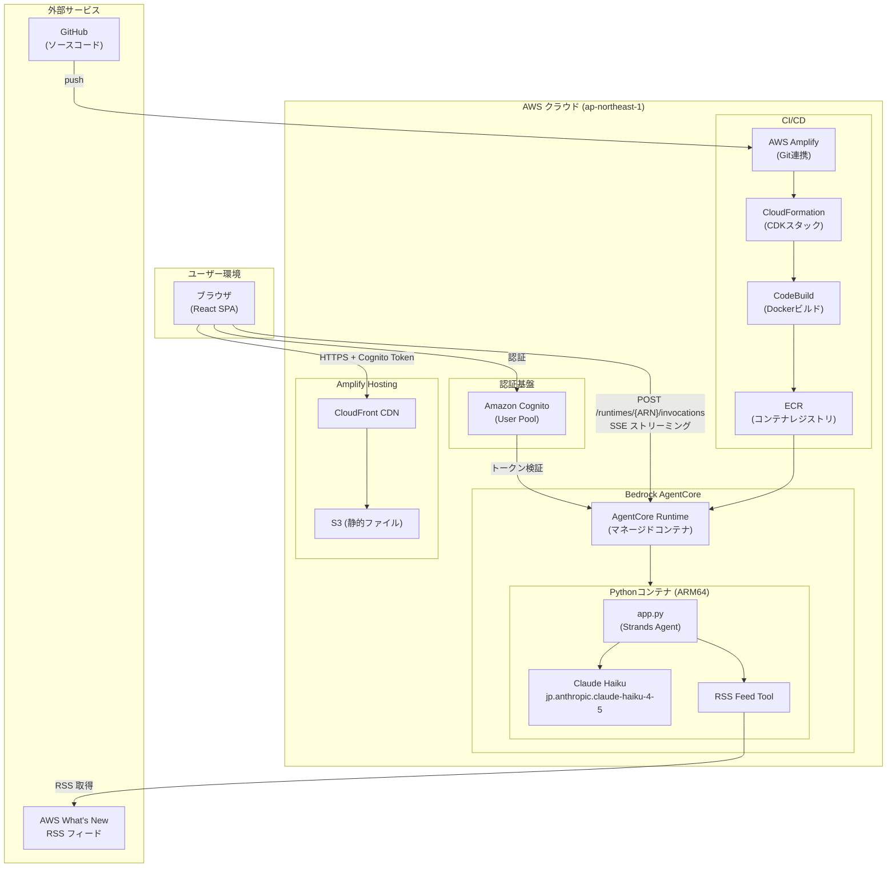
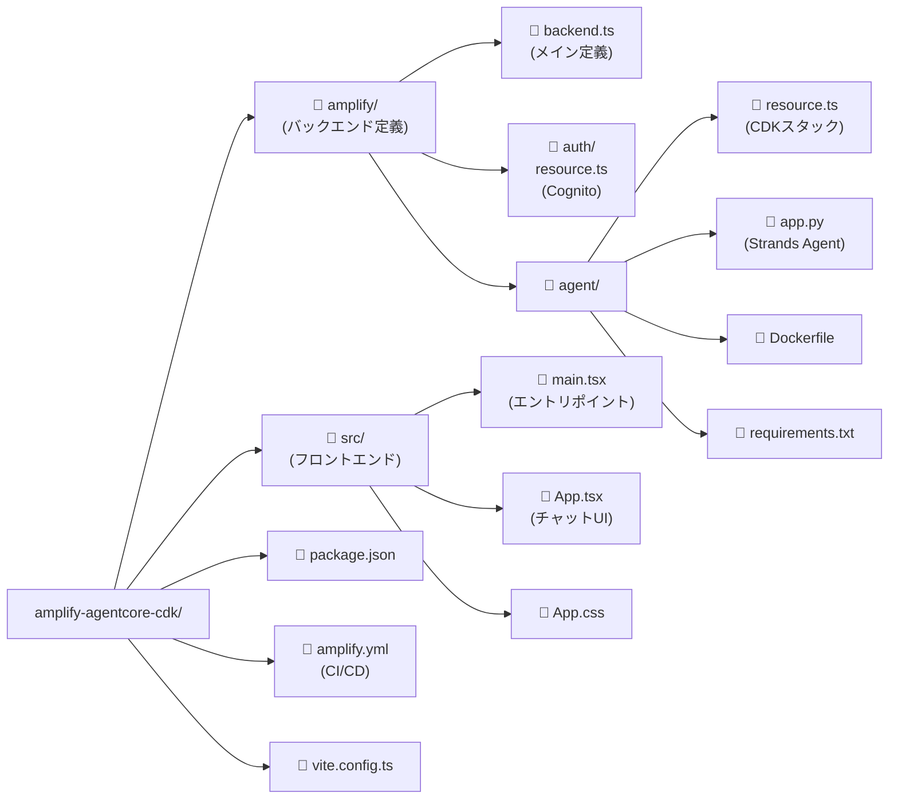
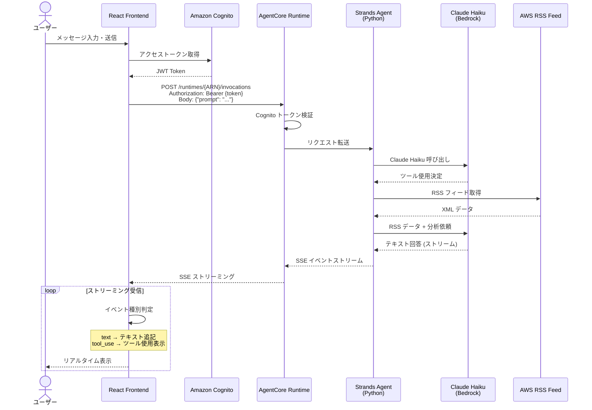
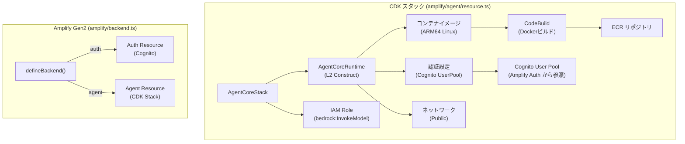
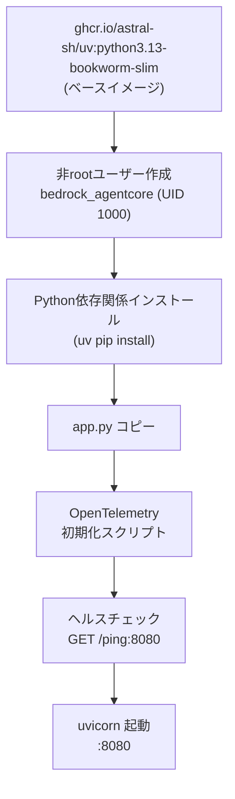
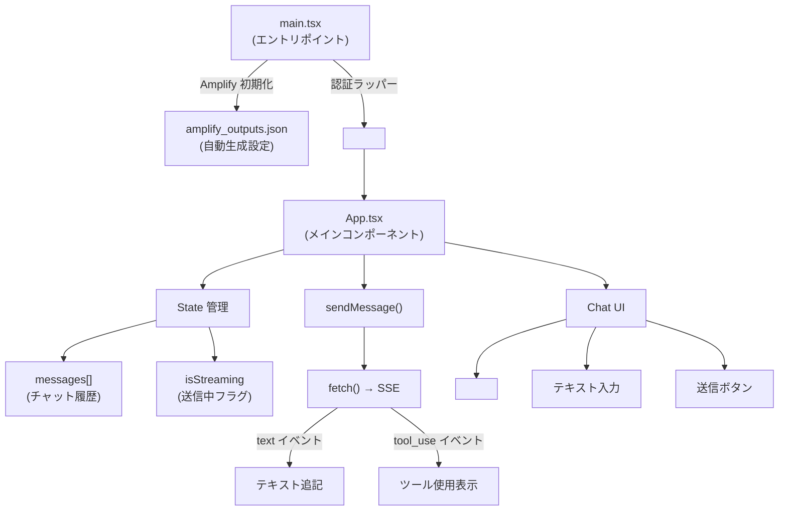
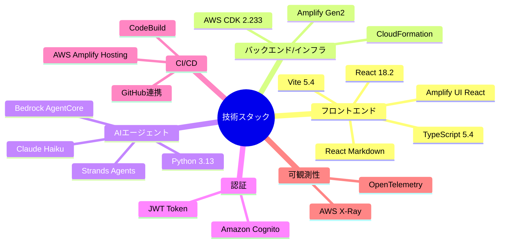
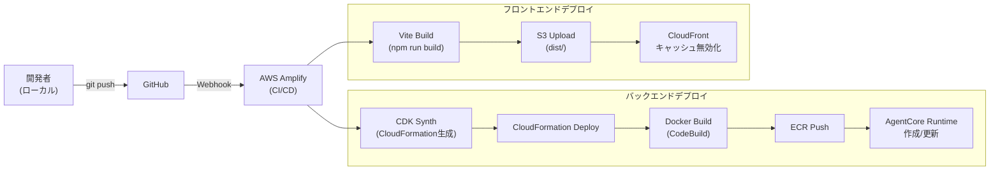
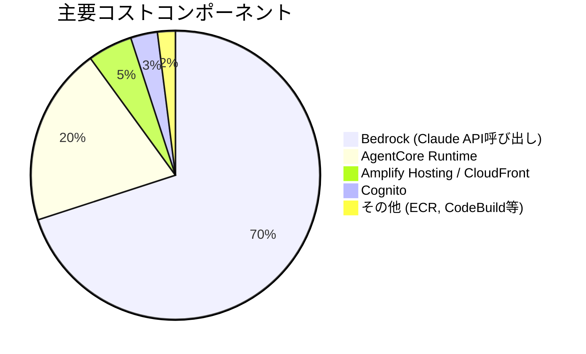

# amplify-agentcore-cdk アーキテクチャ全体像

## プロジェクト概要

AWS Amplify Gen2 + AWS Bedrock AgentCore を使った**サーバーレス AI エージェント Web アプリ**のテンプレートです。
ユーザーがチャットで質問すると、AI エージェント（Claude Haiku）が AWS の最新情報 RSS を取得・分析して回答します。

---

## システム全体構成

---

## ディレクトリ構成

---

## データフロー（リクエスト処理）

---

## インフラ構成（CDK スタック）

---

## コンテナ構成（Dockerfile）

---

## フロントエンドコンポーネント

---

## 技術スタック

---

## デプロイフロー

---

## SSE イベント形式

フロントエンドが受け取るイベントの種類：

| イベント種別 | 内容 | フロントエンドの動作 |
|------------|------|------------------|
| `text` | AI の回答テキスト（断片） | チャットメッセージに追記 |
| `tool_use` | ツール使用通知（例: RSS取得） | "ツール使用中..." 表示 |
| その他 | デバッグ用イベント | 無視 |

---

## 環境変数・設定

| 設定 | 値 | 設定場所 |
|-----|---|---------|
| AWS リージョン | `ap-northeast-1` (東京) | Dockerfile 環境変数 |
| LLM モデル | `jp.anthropic.claude-haiku-4-5-20251001-v1:0` | app.py |
| エージェントポート | `8080` | Dockerfile |
| ランタイム名 | スタック名から自動生成 | resource.ts |
| 認証方式 | Cognito User Pool | resource.ts |

---

## コスト構成（主要課金コンポーネント）

---

## まとめ

このプロジェクトは以下を実現するテンプレートです：

1. **フロントエンド** — Cognito認証付きチャットUI（React + Amplify）
2. **AIエージェント** — RSS取得ツールを持つ Claude Haiku エージェント（Python + Strands）
3. **インフラ** — 完全サーバーレス（CDK + Amplify Gen2 で自動構築）
4. **CI/CD** — GitHub push で自動デプロイ
