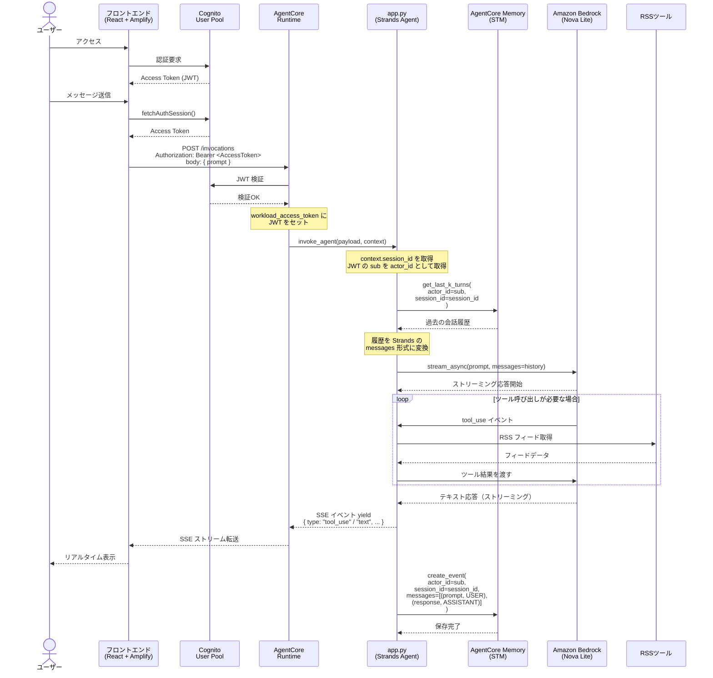
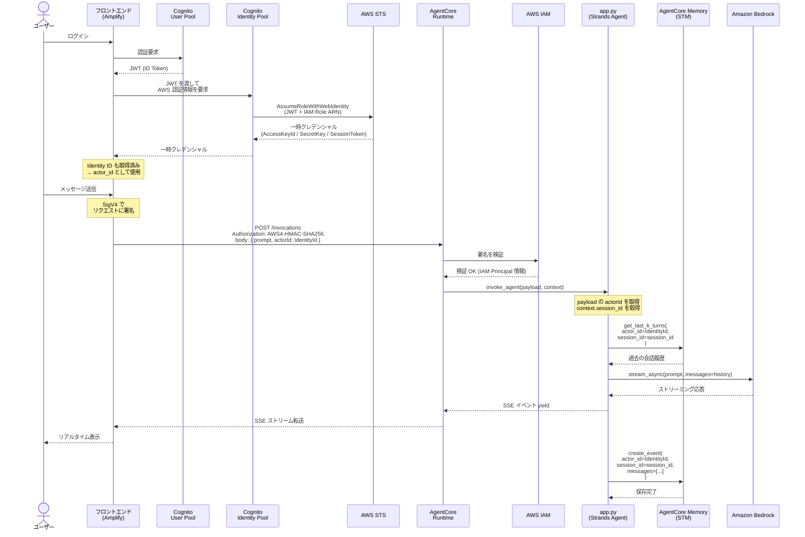

# アーキテクチャ図

## シーケンス図



## コンポーネント構成

| コンポーネント | 技術 | 役割 |
|---|---|---|
| フロントエンド | React + Vite + Amplify UI | チャット UI・認証 |
| 認証 | Amazon Cognito | JWT 発行・検証 |
| ホスティング | AWS Amplify | フロントエンド配信・CI/CD |
| AIランタイム | Bedrock AgentCore Runtime | エージェントコンテナ実行・認証検証 |
| エージェント | Strands Agents (Python) | LLM オーケストレーション |
| LLM | Amazon Nova Lite (Bedrock) | 推論 |
| 短期記憶 | AgentCore Memory (STM) | セッション内会話履歴の保持 |
| ツール | strands-agents-tools (RSS) | 外部情報取得 |

## 認証の流れ

```
JWT の sub クレーム（Cognito ユーザー固有 UUID）
  → AgentCore が workload_access_token にセット
  → app.py が JWT デコードで sub を取得
  → STM の actor_id として使用（ユーザーごとに履歴を分離）
```

---

## 参考：IAM 認証のシーケンス図

本プロジェクトは JWT 認証を採用しているが、IAM 認証（Cognito Identity Pool + SigV4）を使う場合の比較参考図。



## JWT 認証 vs IAM 認証

### エンジニア向け比較

| | JWT 認証（本プロジェクト） | IAM 認証 |
|---|---|---|
| トークン | Cognito Access Token (Bearer) | 一時 IAM クレデンシャル |
| 署名方式 | なし（トークン自体が証明） | SigV4 |
| 検証先 | Cognito | IAM |
| Identity Pool | 不要 | **必要** |
| ユーザー識別 | JWT の `sub` | Cognito Identity ID |
| 複雑さ | シンプル | ステップが多い |

---

### 非エンジニア向けまとめ

#### 🔑 JWT 認証（本プロジェクトの方式）

> 「会員証を見せてそのまま入場する」イメージ

- ✅ **シンプルで速い** — ログインしたらすぐ使える。余分な手続きがない
- ✅ **一般向けサービスに最適** — 不特定多数のユーザーが使うアプリに向いている
- ✅ **開発コストが低い** — 作るのが簡単なので、リリースまでが早い
- ❌ **AWS 内部の細かい権限制御は苦手** — 「このユーザーにはこの機能だけ」という複雑なルールには不向き

**こんなサービスに向いている：** 一般公開のチャットアプリ、社外向けサービス、スタートアップのプロダクト

---

#### 🏢 IAM 認証

> 「受付で身分証を出し、入館証と鍵を借りてから入場する」イメージ

- ✅ **AWS リソースへの細かいアクセス制御ができる** — 「Aさんはこのデータだけ見られる」といった厳密な管理が可能
- ✅ **社内システムや AWS サービス同士の連携に強い** — サーバー同士が自動でやりとりする場面に向いている
- ✅ **大企業・金融・医療など高いセキュリティ要件に対応しやすい** — 既存の社内認証基盤と連携できる
- ❌ **実装が複雑** — 開発に時間とコストがかかる
- ❌ **一般ユーザー向けサービスにはオーバースペック** — 手間に対してメリットが薄い

**こんなサービスに向いている：** 社内ツール、金融・医療系システム、AWS サービス間の自動連携
